```mermaid
---
config:
  theme: 'dark'
  themeVariables:
    # Keeps the main background transparent so it blends with GitHub
    background: 'transparent'
    
    # Text and Lines - White
    textColor: '#ffffff'
    lineColor: '#ffffff'
    fontSize: '20px'

    # ERA (Was Light Blue) -> Now WARM ORANGE
    primaryColor: '#ea580c'
    primaryTextColor: '#ffffff'
    primaryBorderColor: '#fb923c'

    # DATES (Kept Purple)
    secondaryColor: '#8b5cf6'
    secondaryTextColor: '#ffffff'
    secondaryBorderColor: '#a78bfa'

    # EVENTS (Kept Teal/Green)
    tertiaryColor: '#10b981'
    tertiaryTextColor: '#ffffff'
    tertiaryBorderColor: '#34d399'

    # NOTES (Was Black) -> Now SLATE GREY
    noteBkgColor: '#374151'
    noteTextColor: '#ffffff'
    noteBorderColor: '#6b7280'
---

timeline

    2017 : Beginnings  
           : Started coding at age 12  
           : Learned HTML / PHP / CSS  
           : Switched to Unity (C#) and built first video game at ISART Summer School

    2020 : Helvetis Minecraft Server  
         : Joined Helvetis team (5 members)  
         : Became Administrator  
         : Learned Java, SQL, Spigot  
         : Managed a community & developed plugins  
         : Team became close friends and met in real life

    2020-2025 : SpigotMC  
              : Sold custom on-demand plugins  
              : Created & sold Block Party plugin (200+ sales)  
              : Online store and YouTube previews  
              : Since July 2024: plugin becomes community maintained

    2021-2023 : New Horizons  
              : Explored Go, AI, Assembly, C, embedded systems, Rust  
              : Development of small experimental modules

    Summer 2023 : Robotcraft – Ingeniarius  
                 : Completed robotics internship (2 months)  
                 : Learned ROS (C++), robot control, maze solving  
                 : Built and programmed mobile robot systems

    2023-2029 : CY école de design / CY Tech  
               : Dual Degree Engineering & Design (France)  
               : Passion for robotics, software & hardware  
               : Co-founded CyBotics (non-profit robotics association)  
               : First participation in the Coupe de France de Robotique

    2024 : CyBotics – First Competition  
         : Designed robot to move wooden planks on bean cans  
         : Two-person team, succeeded homologation on first try  
         : Learned from other teams and improved robotics skills

    2025 : Coupe de France de Robotique  
         : Developed autonomous competition robots  
         : Embedded C++ & Arduino software  
         : Encoder feedback, odometry, motion control  
         : ROS simulation & algorithm optimization  

```

<h1 align="center">
  Welcome to <ins>Joschma's</ins> profile!
    
</h3>
<h6 align="center">
  Joschka Mayer
</h6>

<!-- Typing SVG by DenverCoder1 - https://github.com/DenverCoder1/readme-typing-svg -->
<!-- 

  

-->

<table width="100%">
  <tr>
    <td align="center" valign="middle" width="50%">
      <h3>🇫🇷🇩🇪 Franco-German</h3>
      <h3>🥐 Lives in Paris</h3>
     
      <h3>💼 Computer Engineering & Global Design  at CyTech</h3>
     
      <h3>🤖 Works in robotics with ROS</h3>
      <h3>📖 Codes in C++ Java Python</h3>
    </td>
    <td align="center" valign="middle" width="50%">
      
    </td>
  </tr>
</table>

  
  &nbsp; &nbsp; 
  

    

<h2>Projects</h2>
<table width="100%">
  <tr>
    <td width="50%" valign="top">
     <h3 align="center"> ROS2 Simulation</h3>
       
      <video src="https://github.com/user-attachments/assets/d2444627-f17e-4aef-86b0-52bc2a15ab69" controls="controls" muted="muted" style="max-width: 100%;">
      </video>
      

        The complete software stack powering our autonomous <b>robot</b> for the French 2025 Robotics Cup. 
        Autonomous navigation simulation. 
        Features <b>Nav2</b>, <b>SLAM</b>, and dynamic obstacle avoidance.
      

      

        <b>Tech Stack:</b> 
        
        
        
        
        
      

      

        
      

    </td>
    <td width="50%" valign="top">
  <h3 align="center">Punic War Tactics</h3>
   
    <video src="https://github.com/user-attachments/assets/4a05d0e9-d251-406e-84b1-faf3b1b79980" controls="controls" muted="muted" style="max-width: 100%;">
    </video>
  

    A turn-based strategy game reconstructing the Punic Wars, built entirely with web technologies. 
    Command Roman or Carthaginian forces, manage units, and strategize to dominate the battlefield.
  

  

    <b>Tech Stack:</b> 
    
    
    
  

  

    
    &nbsp;
    
  

</td>
  </tr>
</table>

<h2>Experiences</h2>
<table width="100%">
  <tr>
    <td width="15%" valign="top" align="center">
      
    </td>
    <td width="85%" valign="top">
      <h3>CyBotics Association</h3>
      

        <b>Co-Founder</b> 
        <i>Sept 2024 – Present | IXCampus</i>
      

      

        Co-founded a robotics association to promote innovation and train student to robotics.
        <ul>
           <li>Leading participation in competitions such as the <i>Coupe de France de Robotique</i>.</li>
           <li>Managing projects and helping other to learn.</li>
        </ul>
      

    </td>
  </tr>

  <tr>
    <td valign="top" align="center">
      
    </td>
    <td valign="top">
      <h3>BrightLoop</h3>
      

        <b>R&D Intern (Power Electronics)</b> 
        <i>July 2025 – Aug 2025 | Paris, France</i>
      

      

        Worked in the power electronics research laboratory on high-performance resonant converters.
        <ul>
           <li>Contributed to the assembly and integration of converters alongside the R&D team.</li>
           <li>Gained hands-on experience with advanced energy management systems.</li>
        </ul>
      

    </td>
  </tr>

  <tr>
    <td valign="top" align="center">
      
    </td>
    <td valign="top">
      <h3>Ingeniarius</h3>
      

        <b>Intern (RobotCraft Program)</b> 
        <i>July 2024 – Aug 2024 | Porto, Portugal</i>
      

      

        Obtained the RobotCraft european certification.
        <ul>
           <li>Used Arduino, Raspery Pi and ROS (Robot Operating System) for mobile robotics.</li>
           <li>Designed, built, and programmed a custom mobile robot from scratch.</li>
        </ul>
      

    </td>
  </tr>

  <tr>
    <td valign="top" align="center">
      
    </td>
    <td valign="top">
      <h3>SpigotMC Pty. Ltd.</h3>
      

        <b>Plugin Developer</b> 
        <i>Dec 2021 – June 2024 | Remote</i>
      

      

        Developed "YMA Block Party", a popular Minecraft game plugin.
        <ul>
          <li>Implemented complex Java game logic and music synchronization.</li>
          <li>Maintained compatibility across Minecraft versions 1.13 to 1.20.</li>
        </ul>
      

    </td>
  </tr>
</table>

<!--

  
<h2>Projects year by year</h2>

  

  

-->
  

  
<h2>Details of all my projects & story</h2>

  <h3>My beginnings (2017)</h3>
  

    My passion for coding started early, at the age of 12 (2017). My first experience was <b>HTML/PHP/CSS</b>. 
    After that, I quickly switched to developing games with <b>Unity</b> in <b>C#</b>. I loved it so much that I decided to attend the Isart
    <a href="https://www.isart.fr/summer-school/code-jeu-video-2d/">summer school</a> during which I have developed my first video game.
    Then, I experienced more with games but felt quickly bored and wanted to learn new things... but didn't really know what! I was young and liked
    playing games more than making some.
  

  <h4>⛏ <ins>Minecraft</ins></h4>
  <ul>
    <li>
      One day as I was playing <strong>Minecraft</strong>, I noticed a group of gamers looking for a programmer to work on their server (if you don't
      know what a server is, it's a place where people can play together) and thought to myself “I already know how to code in C#, it will be easy for
      me to learn Java”. And that's how I joined <a href="http://play.helvetis.net/helvetis/index.html">Helvetis</a>.
    </li>
  </ul>

  

  <h3>⛏ <ins>Helvetis (2020 - 2023)</ins></h3>
  <ul>
    <li>I joined this project at the beginning of may 2020 to 2023</li>
    <li>In this team, we where 5: Wrench: the system admin; Koordan: the builder; Sweet: the organizer; Clim: the modarator; and me: the developer!</li>
    <li>Our goal with this server is to attract as many players as possible.</li>
    <li>
      After joining this project I quickly became <strong>Administrator</strong>. The experience of meeting people randomly on the internet and creating a
      team project without knowing them at all is still stunning for me. This made me learn not only how to attract players but also gave me the role
      of a professional programmer and community manager.
    </li>
    <li>
      Throughout these years I have met a lot of gamers from all over the world. Without this project none of these encounters could have been
      possible. Some were nice some not so...
    </li>
    <li>
      Helvetis really means a lot to me. And these 4 strangers quickly became my online family. We were so close that we even met in real life! 🥳
    </li>
    <li>
      Thanks to this project, I learned Java and discovered the <strong>Spigot</strong> library. I also learned <strong>SQL</strong> and how to manage
      databases.
    </li>
  </ul>

  

  <h3>⛏ <ins>SpigotMC (2020 - 2025)</ins></h3>
  

  <ul>
    <li>SpigotMC is a forum around Minecraft, where you can find many plugins (a plugin is an original game extension)</li>
    <li>
      On this forum I
      <a href="https://www.spigotmc.org/threads/colsed-experienced-developer-affordable-easy-to-use-fully-configurable-plugins.517832/">sold</a>
      on-demand plugins
    </li>
    <li>
      Now, I am selling a Block Party plugin for 19.99€ and I have sold around 200 copies. Here is my online store:
    </li>
  </ul>

  <h4>An image of the store</h4>
  

  
(Click to Expand)

  
  

  
Here is a video:

  

  <ul>
    <li>
      Since jully 2024 the plugin is community
      <a href="https://github.com/joschmaCYU/-YMA-BlockParty/">maintened</a>. It was a real blast to work on this project for less then 2 years but I
      wanted to do some new things!
    </li>
  </ul>

  

  <h3><ins>New horizons</ins></h3>
  

    After developing mostly in <strong>Java</strong> for more that 4 years, I wanted to experience new things! And started to develop small personal
    modules in <strong>Go, AI, Assembly Language, C, Embedded systems, Rust</strong>.
  

  

  <h3><ins>Robotcraft at Ingeniarus: Robotics (Summer 2023)</ins></h3>
  <ul>
    <li>
      During 2 month I attented <a href="https://robotcraft.ingeniarius.pt/">robotcraft</a> and completed, the 2024 Summer Internship at Ingeniarus.
    </li>
    <li>
      I learned a lot but most notably <a href="https://www.ros.org/">ROS</a> which we used extensively in c++. If I had to describe what ROS is it's
      like whatsapp you can create chat group where people can post information or listen to information. This let's us create very complex systems.
      You can find the code that I made in ROS <a href="https://github.com/joschmaCYU/ROS">here</a>.
    </li>
    <li>This is the <a href="https://youtube.com/shorts/SXlsa0vp95U?feature=share">robot</a> that we used</li>
    <li>At the end we had to resolve a maze with our <a href="https://youtube.com/shorts/XMeQIIvutdI">robot</a></li>
  </ul>

  

  <h3><ins>CY école de design / CY Tech (2023 - 2029)</ins></h3>
  <ul>
    <li>I am currently studing at Cy école de design, in a dual degree student in Engineering & Design at CY Tech in France.</li>
    <li>
      I created my own none profit with my friend Alann,
      <a href="https://linktr.ee/clubcybotics"><strong>CyBotics</strong></a> !
      We have specialized our selves in robotics and participated for our first year at the
      <a href="https://www.coupederobotique.fr/">coupe de France de robotique</a> where we had to build a robot that moves wood plank on top of bean
      cans. This cup was where impressive for ous. We where just two student that never participated and managed to homologate our robot which is not
      given for a first timer. Other teams (which are 15 people on averadge) where very cool and we talk and learned a lot of new things !
    </li>
  </ul>

  

  <h3><ins>Robotic French Cup - Coupe de France de robotique (2025)</ins></h3>
  

    As part of CyBotics, the robotics association I co-founded, I designed and developed autonomous robots to compete in the Coupe de France de
    Robotique 2025 (French Robotics Cup). Our goal was to build fully autonomous robots capable of completing complex tasks on a themed arena within
    100 seconds, without any human intervention.
  

  
My main contributions included:

  <ul>
    <li>Embedded software development in C++ and Arduino, focusing on motor control, sensor fusion, and autonomous decision-making.</li>
    <li>Integration of encoder feedback for precise motion control and odometry.</li>
    <li>ROS-based simulation and testing, optimizing algorithms before hardware deployment.</li>
    <li>Mechanical and electronic integration, collaborating closely with design and electrical teams.</li>
    <li>Strategic behavior design, implementing task sequencing and collision avoidance.</li>
  </ul>

  

    This project involved the full development cycle — from prototyping and electronics assembly to software optimization and field testing —
    combining teamwork, systems engineering, and innovation under real competition constraints.
  

  

## 🛠️ Technical skills
### 👨‍💻 Programming languages

  

### 💻 Softwares and tools

    
    
    
    
    
    
    
    
    
    
    
    

